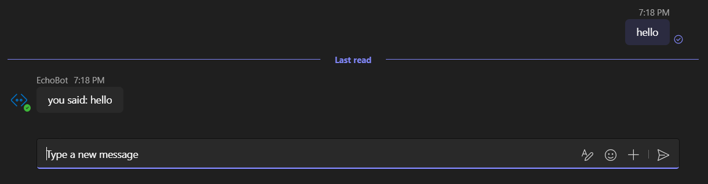
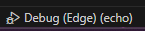
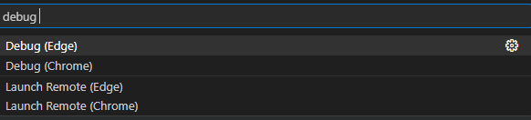
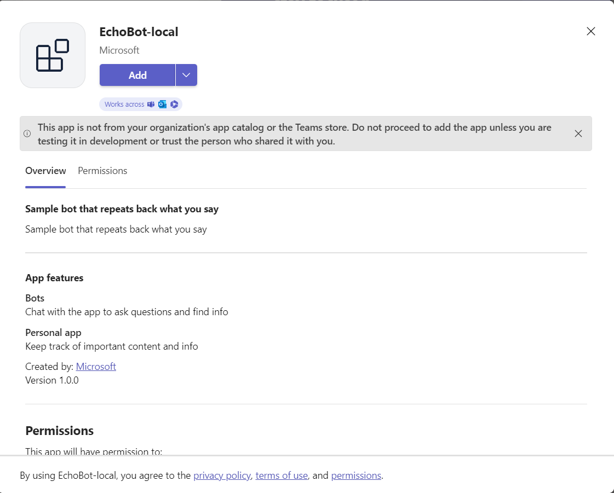

#  Echo Bot

Teams AI Conversation Bot sample for Teams.

This sample shows how to incorporate basic conversational flow into a Teams application. It also illustrates a few of the Teams specific calls you can make from your bot.

- [Concepts](#concepts)
- [Prerequisites](#prerequisites)
- [Run](#run)
- [Development](#development)

## Concepts

- Listening/Sending Activities
- Error Handling

## Prerequisites

- Install [Python](https://www.python.org/downloads/) (>= 3.8)
- Install [Python VSCode Extension](https://marketplace.visualstudio.com/items?itemName=ms-python.python)
- Install [Teams Toolkit VSCode Plugin](https://marketplace.visualstudio.com/items?itemName=TeamsDevApp.ms-teams-vscode-extension)

## Run

> If you do not have permission to upload custom apps (sideloading), Teams Toolkit will recommend creating and using a Microsoft 365 Developer Program account - a free program to get your own dev environment sandbox that includes Teams.

1. Select **File > Open Folder** in VS Code and choose this sample directory from the repo.
1. Press **CTRL+Shift+P** to open the command box and enter **Python: Create Environment** to create and activate your desired virtual environment. Remember to select `requirements.txt` as dependencies to install when creating the virtual environment.
1. Using the extension, sign in with your Microsoft 365 account where you have permissions to upload custom apps.
1. Select **Debug > Start Debugging** or **F5** to run the app in a Teams web client.
    > To run samples we encourage the use of the [Teams Toolkit VSCode Plugin](https://marketplace.visualstudio.com/items?itemName=TeamsDevApp.ms-teams-vscode-extension), to run the project using `Teams Toolkit` click the `Debug` button and select a profile.
      
    
1. In the browser that launches, select the **Add** button to install the app to Teams.
    > When prompted, add your app in teams and start chatting!  
    

## Notebooks

There are two Jupyter notebooks in this repo. 
1. [How-to-create-an-echobot](How-to-create-an-echobot.ipynb) guides you step by step to create a Teams-ai echo bot and demonstrates you how does every single modules work.
1. [Try-the-bot](Try-the-bot.ipynb) makes a playground for you to straightly call and test any functions defined in `src/*.py` modules.